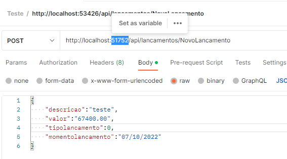

# ProjetoTeste

## Iniciando Projeto

Com o botão direito em cima do projeto escolha a opção **abrir com** e abra com o Visual Studio. Neste projeto foi utilizado a versão 2022. 

Aponte para o Visual Studio em qual projeto deve se iniciar, e no nosso caso escolha a opção docker-compose.
Clique com o botão direito em cima do projeto docker-compose e clique na opção **Set Startup Project**.

Vamos agora iniciar o projeto. Clicando no ícone de start do Projeto Selecionado, e no nosso caso o docker-compose, conforme mensionado acima.

Após alguns segundos abrirá o browser de sua preferência com uma api de exemplo do projeto do asp.net core web api.

Aqui só aproveitaremos a porta em que a aplicação está rodando, para então chamar os serviços no Postman.
Na raiz do projeto existe uma pasta chamada **postman-collection** com a coleção de serviços do Postman, é necessário importar para o Postman.

Após importado você terá 2 serviços, o de incluir novos Lançamentos e o da Consolidação Diária.

Vamos aproveitar agora a porta mostrada no browser e trocar as portas no postman dos serviços.

Troque nos 2 serviços.

O projeto está agora pronto para ser testado.
Temos 2 opções para incluir um Lançamento. São seus tipos.

Ao vermos a imagem do serviço de **POST** temos o atributo tipolancamento que é definido da seguinte forma:

tipolancamento = 0 => Lancamento Tipo Debito

tipolancamento = 1 => Lancamento Tipo Crédito

É momento de incluir alguns registros e verificar a Consolidação Diária.

## Arquitetura

- Camada de aplicação: responsável pelo projeto principal, pois é onde será desenvolvido os controladores e serviços da API. Tem a função de receber todas as requisições e direcioná-las a algum serviço para executar uma determinada ação.
Possui referências das camadas Service e Domain.

- Camada de domínio: responsável pela implementação de classes/modelos, as quais serão mapeadas para o banco de dados, além de obter as declarações de interfaces, constantes, DTOs (Data Transfer Object) e enums.

- Camada de serviço: seria o “coração” do projeto, pois é nela que é feita todas as regras de negócio e todas as validações, antes de persistir os dados no banco de dados.
Possui referências das camadas Domain, Infra.Data e Infra.CrossCutting.

- Camada de infraestrutura: 
    - Data: realiza a persistência com o banco de dados, utilizando, ou não, algum ORM.

    - Cross-Cutting: uma camada a parte que não obedece a hierarquia de camada. Como o próprio nome diz, essa camada cruza toda a hierarquia. Contém as funcionalidades que pode ser utilizada em qualquer parte do código, como, por exemplo, validação de CPF/CNPJ, consumo de API externa e utilização de alguma segurança.
Possui referências da camada Domain.

**Neste projeto teste não foi utilizada essa camada.**

## Tenologias

- .Net Core 6
- Csharp
- Entity Framework
- AutoMapper

## Padrões

- DDD
- Repository
- Validation

## Melhores Práticas
- Clean Code
- SOLID

